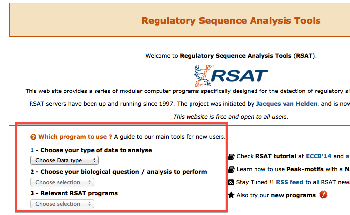

### Welcome to RSAT Training material

#### Context of RSAT
The release of complete genomic sequences not only offered a huge
amount of new data for the molecular biologist, but also impulsed the
development of new computational techniques required for the analysis
of these data.
Non-coding sequences present a striking interest since they govern the regulation of gene
expression.

The [Regulatory Sequence Analysis Tools (RSAT)](http://rsat.eu) modular computer programs specifically designed for the detection of regulatory signals in non-coding sequences.
RSAT servers have been up and running since 1997. The project was initiated by **Jacques van Helden** <jacques.van-helden@univ-amu.fr>, and is now pursued by the RSAT team. 

#### A dedicated server for learning

To learn how to use RSAT, we recommend you to use the dedicated server [http://teaching.rsat.eu/](http://teaching.rsat.eu/).

*Although tutorials and protocols used to indicate other URLs (like http://rsat.ulb.ac.be), we now recommend to use [http://teaching.rsat.eu/](http://teaching.rsat.eu/).*

#### Where to start ?

* To get an **overview** of the tools, you may read the latest description in *NAR web server issue*: 
Thomas-Chollier M, Defrance M, Medina-Rivera A, Sand O, Herrmann C, Thieffry D, van Helden J. (2011) 
<a href="http://nar.oxfordjournals.org/content/39/suppl_2/W86.long" target="_blank">RSAT 2011: regulatory sequence analysis tools</a>. Nucleic Acids Res. 2011 Jul;39(Web Server issue):W86-91.

* Several protocols have been published to guide new users. *Some of the content might be outdated, but the theory and general principles are still valid*

	* **ChIP-seq analysis** Thomas-Chollier M, Darbo E, Herrmann C, Defrance M, Thieffry D, van Helden J. (2012). <a target='_blank' href='http://www.ncbi.nlm.nih.gov/pubmed/22836136'>A complete workflow for the analysis
    of full-size ChIP-seq (and similar) data sets using peak-motifs</a>. Nat Protoc 7(8): 1551-1568. 

	* **Scanning sequences with motifs** Turatsinze, J.V., Thomas-Chollier, M., Defrance, M. and van Helden, J. (2008) <a target='_blank' href='http://www.ncbi.nlm.nih.gov/pubmed/18802439'>Using RSAT to scan genome sequences for transcription factor binding sites and cis-regulatory modules</a>. 
	Nat Protoc, 3, 1578-1588.</a>

	* **Motif discovery** Defrance, M., Janky, R., Sand, O. and van Helden, J. (2008)
<a target='_blank' href='http://www.ncbi.nlm.nih.gov/pubmed/18802440'>Using RSAT oligo-analysis and dyad-analysis tools to discover
regulatory signals in nucleic sequences</a>. Nat Protoc, 3,
1589-1603. 

	* **Web services access (advanced usage for bioinformaticians)** Sand, O., Thomas-Chollier, M., Vervisch, E. and van Helden,
J. (2008) <a
target='_blank' href='http://www.ncbi.nlm.nih.gov/pubmed/18802441'>Analyzing multiple data sets by interconnecting RSAT
programs via SOAP Web services-an example with ChIP-chip data</a>. Nat
Protoc, 3,1604-1615.

#### Hands-on Tutorials

* ECCB 2014 tutorial (covers access via Web site, command-line and Web services): 
	<a target='_blank' href="http://rsa-tools.github.io/tutorial_eccb14/index.html"> Analysis of Cis-Regulatory Motifs from High-Throughput Sequence Sets</a>.
	
* Tutorials of individual tools on the RSAT Web site: [http://teaching.rsat.eu/rsat/tutorials/](http://teaching.rsat.eu/rsat/tutorials/)

#### Complete course on analysis of regulatory sequences

* Course by Jacques van Helden : [http://rsa-tools.github.io/course/](http://rsa-tools.github.io/course/)

#### Which tool to choose ?

The home page of each RSAT server has a section to help finding the appropriate program, based on the type of data and question. Only main tasks are supported, as this is meant to new users.

Also check the map of the tools (version 2012):

#### Even more resources...

* Workshop: [ChIP-Seq Data Analysis] (http://morganetc.github.io/atelier_chip-seq_roscoff_2014/), in the context of Ecole de bioinformatique AVIESAN 2014, Station Biologique, Roscoff, France.

* Course by Jacques van Helden : [Statistics for bioinformatics](http://pedagogix-tagc.univ-mrs.fr/courses/statistics_bioinformatics/)
 
* ALLBIO training workshop 2014 [Analysing thousands of bacterial genomes: gene annotation, metabolism and regulation](http://pedagogix-tagc.univ-mrs.fr/allbio/)

#### Contact and Questions
Check out the [RSAT forum](http://www.bigre.ulb.ac.be/forums/) to see questions of users or to contact the RSAT team.